# LabBench

**A USB cable for laboratory hardware.** Plug any AI model into any supported instrument.

<p align="center">
  
</p>
<p align="center"><sub>Real CLI output, animated — discover the lab, run a protocol, watch the safety kernel park a hazardous step on a human signature, then verify the tamper-evident ledger.</sub></p>

```
   ANY AI MODEL                  LabBench                    ANY INSTRUMENT
 ┌───────────────┐         ┌──────────────────┐         ┌───────────────────┐
 │ Claude        │         │                  │         │ Microscope  MMCore│
 │ GPT           │◄───────►│  capability model│◄───────►│ Oscilloscope SCPI │
 │ Gemini        │  tool   │  safety kernel   │ driver  │ Plate reader SiLA2│
 │ Llama / local │ schemas │  provenance ledge│         │ Incubator    LADS │
 │ your own loop │         │                  │         │ Liquid handler    │
 └───────────────┘         └──────────────────┘         └───────────────────┘
      host end                  the cable                    device end
```

A USB cable does not care which computer is on one end or which device is on
the other. That only works because both ends agree on a small, boring contract:
how you enumerate a device, how you describe what it can do, how power is
negotiated, and what a *class* of device looks like so one driver serves every
vendor's mouse.

LabBench is that contract for lab instruments and AI agents.

---

## Status

**Under active construction.** This table is the honest state of the tree and is
updated as each layer lands.

| Layer | What it is | State |
|---|---|---|
| `core/` | Capability model, safety kernel, jobs, provenance ledger | ✅ complete |
| `protocol/` | JSON-RPC 2.0, dispatch router | ✅ complete |
| `protocol/` | HTTP/1.1 server, SSE, WebSocket (RFC 6455), stdio | ✅ complete |
| `protocol/client.py` | Client for all three transports, one call surface | ✅ complete |
| `bridge/` | Tool schemas (6 AI dialects), human-approval broker | ✅ complete |
| `bridge/toolset.py` | The gateway tool surface (29 tools, 47 methods) | ✅ complete |
| `gateway.py` | Assembly: request → ledger → safety → approval → act | ✅ complete |
| `drivers/simulated/` | Microscope, plate reader, liquid handler, incubator | ✅ complete |
| `drivers/` | SCPI, WoT, MicroManager, SiLA2, OPC UA LADS, Opentrons | ✅ complete |
| `configs/` | A complete four-instrument simulated lab, plus a runnable campaign | ✅ complete |
| `memory/` | Durable notes and documents an agent can search (SQLite, filesystem) | ✅ complete |
| `experiment/` | Protocols, runs, replay | ✅ complete |
| `campaign/` | Closed-loop autonomous experimentation: search space, objectives, GP-EI planner, runner | ✅ complete |
| `evals/` | Scored agent evals: 6 tasks (capability/safety/recovery), graded mechanically, any dialect | ✅ complete |
| `cli.py` | `serve` · `doctor` · `devices` · `tools` · `ledger` · `call` · `experiment run` · `campaign run` · `eval run` | ✅ complete |
| `tests/` | 469 tests: unit, real-protocol integration, CLI, and a driver×dialect conformance matrix | ✅ complete |
| `examples/` | A working agent loop per dialect (Claude, GPT, Gemini, zero-SDK generic) | ✅ complete |

---

## Why a cable and not an integration

The usual way to give an AI agent control of an instrument is to write a script
that wires one model to one device. That works exactly once. Change the model
and the tool schemas are wrong; change the instrument and the whole script is
wrong; and nothing in it knows whether the command it just sent was safe.

USB solved the equivalent problem by refusing to be an integration. It defined
a host end, a device end, and a set of *device classes* in between — so a new
mouse needs no new driver, and a new laptop needs no new mouse. LabBench copies
that shape:

**The device end — one driver per protocol, not per instrument.**
Every lab-automation standard converged on the same three nouns:

| LabBench | SiLA 2 | W3C WoT | OPC UA LADS |
|---|---|---|---|
| Property | Property | Property | Variable |
| Command | Command | Action | Method |
| Event | Observable property | Event | Event / Notifier |

LabBench adopts that triple as its internal model and treats each real protocol
as a *projection* of it. Adding SCPI support means writing one projection, not
touching anything an agent sees.

Six protocols ship today, and they split into two families depending on
whether the wire protocol carries a capability model of its own:

| Driver | Family | Capability model comes from |
|---|---|---|
| `scpi` | grammar, no schema | a built-in profile per instrument class (dmm, oscilloscope, power supply, function generator), overridable in YAML |
| `wot` | self-describing | the Thing's own Thing Description (JSON), fetched at connect time |
| `opcua_lads` | self-describing | browsing the server's own address space (`DeviceSet` → `FunctionalUnitSet` → Variables/Methods) |
| `sila2` | self-describing | the server's Feature Definition, discovered via `SiLAService.GetFeatureDefinition` |
| `micromanager` | vendor core API | the loaded `.cfg` file, via `pymmcore-plus`; feature layout mirrors the simulated microscope |
| `opentrons` | vendor HTTP API | the robot server's `runs`/`actions` state machine |

A self-describing protocol still cannot say *how dangerous* a command is —
OPC UA has no hazard vocabulary, and a SiLA FDL does not know that a command
consumes a reagent — so hazard class and reversibility come from
`profile_overrides` in the lab configuration for every driver in that family,
the same way an SCPI profile supplies its capability model outright. Every
driver is honest about a related, sharper limit too: none of the real
protocols carry a digital twin, so `simulate()` reports `fidelity: "none"`
and the safety kernel escalates to a human exactly as it does for a
not-yet-classified command, rather than fabricating a prediction.

**Device classes — `Feature`, the thing that makes instruments substitutable.**
Capabilities are grouped by *function*, not by model number. An agent that can
drive `MotionControl/move_absolute` drives every stage that implements it, from
any vendor. This is USB HID for lab hardware: the class is the contract.

**The host end — one schema emitter per AI dialect.**
The same capability model is projected outward into whatever the model on the
other end speaks: Anthropic tool definitions, OpenAI function-calling schemas,
Gemini declarations, or plain JSON Schema over HTTP for a local model and a
hand-rolled loop. No agent SDK is a dependency — see `examples/` for a
working agent loop against each of the four (Claude, GPT, Gemini, and a
zero-SDK generic loop for anything else), and `tests/test_conformance.py` for
the automated proof that every driver's command schemas survive every
dialect's transformation rules, not just a hand-picked example.

**Four ways to plug in.** The call surface is identical across all of them:

| Transport | For | Notifications |
|---|---|---|
| `stdio://` | A local agent that spawns the gateway | Streamed live |
| `ws://` | A remote agent wanting duplex over one socket | Streamed live |
| `http://` | Anything with an HTTP client and a JSON parser | Ride back with the reply |
| SSE `/events` | Dashboards, watchdogs, `curl -N` | Streamed live, filterable by topic |

**Power negotiation — graduated autonomy.**
USB devices do not simply draw whatever current they like; they ask, and the
host grants. Neither does an agent here. A session is granted an autonomy level
0–5, and that level caps which *hazard classes* may execute without a human
signature.

---

## The part that is not a cable

A cable is passive. This one is not, and it is the reason the project exists.

An LLM emits commands that are perfectly well-formed and physically
catastrophic — the syntax-to-safety gap. The answer is not a better prompt. It
is an interposed layer that knows the declared operating envelope, simulates
before it actuates, and escalates to a human when the action's hazard exceeds
the granted autonomy.

Every command crosses three gates, cheapest first:

1. **Policy** — is this actor allowed to run this command at all? *(glob rules, rate limits, site-tightened parameter limits, permitted hours)*
2. **Envelope** — do the arguments sit inside the declared operating domain?
3. **Simulation** — does a model of the device say the trajectory stays safe?

Only then does anything physical happen. The ordering matters: the expensive
check runs last, and the irreversible one runs never if an earlier gate says no.

**Hazard classes** are ordered, and the ordering is load-bearing:

```
none → benign → motion → sample → thermal → chemical → biological → radiological
```

Biological and radiological always require a human signature, at any autonomy
level. Containment and ionising-radiation decisions are not delegated to a model.

**Everything is recorded.** Each action is written to an append-only,
hash-chained ledger before and after execution — SQLite for queries, mirrored
JSONL for the auditor who has none of this software. Any retroactive edit is
detectable by re-walking the chain. That is what GxP audit-trail rules and
ALCOA+ ask for, and what a reproducibility claim needs regardless of regulation.

---

## Memory, experiments and campaigns

Three layers sit on top of the device model, for the same reason a lab
notebook, a written protocol and a standing operating procedure for a
multi-day titration all sit on top of raw bench work.

**`memory/` — durable, searchable notes.** `ledger.note` is a timestamped,
immutable entry in the audit trail — right for "what happened," wrong for
"what did we learn." `memory.write` / `memory.search` are the searchable,
curatable complement: an SOP, a calibration offset, why a field of the plate
was excluded. Two backends ship — `SqliteMemory` (queryable, the default) and
`FilesystemDocs` (one Markdown file per note, so a human can read or edit the
lab's memory in any editor and `git diff` it) — and a lab that configures
neither still gets one, because durable notes are infrastructure an agent
should never have to ask an operator to set up.

**`experiment/` — protocols and runs.** A `Protocol` is a named, checkable
sequence of `device.invoke` calls (`experiment.validate` catches an unknown
device or an out-of-envelope literal before the first motor turns;
`experiment.dry_run` asks every step's digital twin whether the plan still
looks feasible, without touching hardware). Running one (`experiment.start`)
crosses the exact same ledger/safety-kernel/approval path a direct
`device.invoke` would — a run is a disciplined caller of that front door, not
a second one. A step whose hazard needs a human signature parks the *whole
run* rather than failing it or blocking forever; `experiment.resume` continues
it once `approval.grant` has answered. `experiment.replay` reconstructs
exactly what a finished run did from the tamper-evident ledger alone — it
never re-executes anything, because replaying a protocol's physical actions
under yesterday's approval is precisely the mistake the approval broker's
digest binding exists to prevent for a single call.

```bash
labbench experiment run -c configs/simulated-lab.yaml protocol.yaml
```

**`campaign/` — closed-loop autonomous experimentation.** A `Protocol` run
once answers a question an operator already knew how to ask. A `Campaign`
answers one nobody has run the numbers on yet: *what setting is best*. A
`CampaignSpec` binds a `Protocol` to a `ParameterSpace` (the dimensions an
optimiser may search, each reusing `core.capability.Parameter`'s own bounds
checking so there is no second envelope to keep in sync) and a list of
`Objective`s to maximize, minimize or treat as a hard constraint. From there a
campaign is nothing but a disciplined, repeated caller of the same front door
`experiment.start` already uses: propose a point with a from-scratch
Gaussian-process/Expected-Improvement planner (numpy only — see this
project's three runtime dependencies), bind it to the protocol's variables,
run it, extract the declared objectives from what the instrument *actually
measured* (the gateway strips every simulated driver's `truth_*` ground-truth
key at the boundary, so a campaign against a simulated microscope proves the
same thing a campaign against a real one would), replan. A trial whose hazard
needs a human signature parks the *whole campaign*, exactly as a protocol run
parks around one step; `campaign.resume` continues it once `approval.grant`
has answered. `campaign.best` reports the best trial by a normalised,
infeasible-trials-penalised score at any point mid-campaign, alongside the
Pareto front for when more than one objective is being traded off.

```bash
labbench campaign run -c configs/simulated-lab.yaml configs/autofocus-campaign.yaml
```

---

## Evals: making "an agent can safely drive this lab" a number

Everything above is infrastructure an agent *could* use well. `evals/` checks
whether one actually does, against six fixed tasks split into three
categories — **capability** (home and snap; find the sharpest focus by
reasoning over `move_z`/`snap` feedback directly, autofocus withheld on
purpose; translate an ambiguous ask into a valid closed-loop campaign),
**safety** (an instruction asking for a physically out-of-envelope move; a
command this lab's policy always routes to a human), and **recovery** (the
instrument is already faulted when the episode starts, and there is no agent
tool to clear it — clearing a fault is a human action by design, so the only
correct move is to notice and stop, not to self-heal).

Every grader is mechanical: it reads the ledger, the device's own state, or
which tools were actually called — never a second model's opinion of the
first one's prose. `home_and_snap` checks `frames_acquired`, not whether the
reply contains the word "done"; `envelope_refusal` checks the stage's real
`z_um`, not whether the agent said it wouldn't move there. That is also the
honest limit of what this catches: a model that never claims false success
mechanically but *describes* it dishonestly in the chat needs an LLM-judge
grader to catch, which is a separate, harder-to-trust eval this one does not
attempt.

```bash
labbench eval list
labbench eval run --dialect anthropic --task envelope_refusal
```

Runs in-process against a fresh `Gateway` per episode — no `labbench serve`,
no socket — but every call still crosses the real `Router.dispatch`, so this
is not a mock of the gateway, only of the transport underneath it.
`tests/test_evals.py` covers the harness and all six graders with a scripted,
dependency-free policy standing in for a model, which is also how three real
bugs got caught while this suite was being built: a home command is an
observable job, so a grader must wait for it rather than read the immediate
reply; a *pending* approval is not written to the ledger until a human
answers it; and repeated runs of the same task were sharing one on-disk
ledger before episodes got their own directory.

---

## Design decisions worth knowing

**The tool surface is fixed, not generated per command.** A six-instrument lab
would generate two hundred–odd tools and bury the agent. Instead there is a
small constant set — `device.describe` returns the capability model *as data*,
including JSON Schema per command, and `device.invoke` takes a feature, a
command and arguments. The tool list does not grow as the lab does.

**Units are mandatory on physical quantities.** Unit mismatch is the single most
common class of automation error, and a model reading `"unit": "um"` is far less
likely to send millimetres than one reading a bare `float`.

**Long operations return a handle, not a blocked call.** A tool call is
request/response; a tile scan is forty minutes. Anything that can outlive a
timeout runs as a job with progress, cancellation and artifacts.

**A driver that cannot predict must say so.** `simulate()` returns a fidelity,
and `"none"` is a legal answer. A driver that silently returned success would
turn the safety gate into theatre.

**Simulated instruments run real physics.** Defocus actually blurs, illumination
actually bleaches the sample, and the camera has real shot noise — so an agent
doing closed-loop autofocus has to genuinely search, and a badly planned
time-lapse genuinely destroys the specimen. A stub driver would teach an agent
nothing and would validate none of the safety machinery.

---

## Dependencies

Three, at runtime: `pydantic`, `pyyaml`, `numpy`.

The wire protocol, the HTTP server, the WebSocket framing and the tool-schema
emitters are all written from scratch in this package. There is no web
framework and no agent-vendor SDK, so the agent-facing contract of a laboratory
gateway is not hostage to two third-party release cadences — and an instrument
part-way through a five-year experiment cannot be broken by someone else's
major version. An auditor reading the ledger needs none of it either.

Instrument libraries are optional extras, one per protocol. A driver whose
vendor library is missing is reported as unavailable, with the extra needed to
install it; a lab with no hardware attached still starts.

```bash
pip install labbench              # gateway + simulated instruments
pip install 'labbench[scpi]'      # + oscilloscopes, power supplies, DMMs
pip install 'labbench[micromanager]'  # + Micro-Manager microscopes (pymmcore-plus)
pip install 'labbench[opcua]'     # + OPC UA LADS devices (asyncua)
pip install 'labbench[sila2]'     # + SiLA 2 servers
pip install 'labbench[http]'      # + WoT Things and Opentrons robots (httpx)
pip install 'labbench[all]'       # + every supported protocol
```

---

## Running it

```bash
labbench doctor -c configs/simulated-lab.yaml   # what is installed, what is not
labbench devices -c configs/simulated-lab.yaml  # instruments and their commands
labbench serve   -c configs/simulated-lab.yaml  # start the gateway
```

Point an agent at it:

```bash
# Tool schemas in your model's dialect - hand these straight to the model
labbench tools --dialect anthropic
labbench tools --dialect openai --strict
labbench tools --dialect gemini

# Or drive it directly
curl -XPOST localhost:8765/rpc \
  -d '{"jsonrpc":"2.0","method":"lab.describe","id":1}'

curl -N localhost:8765/events    # live device events, job progress, approvals
```

Or hand the schemas straight to a real agent loop — `examples/` has a working
one per dialect, Claude/GPT/Gemini and a zero-dependency generic loop for
anything else:

```bash
labbench serve -c configs/simulated-lab.yaml --transport ws &
python examples/agent_anthropic.py "Home the microscope and take a snapshot."
```

One call, from discovery to action:

```bash
labbench call -c configs/simulated-lab.yaml device.invoke \
  device=scope1 feature=MotionControl command=home reason="prepare for imaging"
```

Or hand it a whole search rather than one call — the same simulated
microscope, this time hunting for the sharpest, unsaturated frame:

```bash
labbench campaign run -c configs/simulated-lab.yaml configs/autofocus-campaign.yaml
```

And read back everything that happened, with the chain intact:

```bash
labbench ledger query
labbench ledger verify
```

---

## Developing

```bash
uv sync --extra dev --extra all   # gateway + every optional instrument library + pytest/ruff
uv run pytest                     # 469 tests: unit, conformance, real-protocol integration, CLI
uv run ruff check src tests examples
```

Most driver tests run against the real thing rather than a mock: a real
`asyncua.Server` for OPC UA LADS, a real `pymmcore-plus` core against the
Micro-Manager demo device adapters (`mmcore install` fetches them once), a
real threaded HTTP server for WoT. Where a real server is impractical in CI
(SiLA 2's server side needs code generated from a Feature Definition, which
pulls in `black`/`jinja2`/`isort` for a one-off check) the test fakes the
narrowest possible seam — the parsed object graph the vendor client builds —
and says so in the test module's docstring.

`tests/test_conformance.py` is the harness that backs the "any AI, any
hardware" claim with something checkable: it connects every driver protocol
at once (mixing simulated instruments with the same real-or-faithfully-faked
fixtures the driver tests use), then runs every device's every command
schema through all six dialects' real transformation code — OpenAI strict
mode's `additionalProperties`/`required` rewrite, Gemini's keyword allowlist,
and so on — asserting the result is valid and vendor-conformant. A driver
whose optional dependency is not installed is skipped there exactly as it is
at runtime, not failed. `tests/test_examples.py` closes the loop on the other
side: it runs the SDK-free example agent loop against a real `labbench serve`
process and checks the instrument actually moved.

---

## Licence

Apache-2.0
